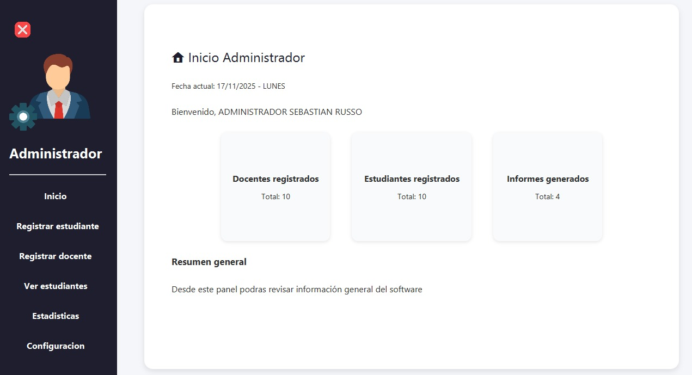

# ProyectoAula - Sistema de Gestión Escolar y Control de Asistencia

## 1. Descripción General

**ProyectoAula** es una aplicación de escritorio desarrollada en Java diseñada para optimizar la gestión administrativa y académica en instituciones educativas. Su objetivo principal es automatizar el registro de estudiantes y docentes, así como el control de asistencia (específicamente llegadas tarde).

El sistema permite a los administradores generar informes automáticos en formato de texto para notificar a los padres de familia sobre el comportamiento de asistencia de los estudiantes, facilitando la comunicación y el seguimiento académico.

## 2. Tecnologías Utilizadas

El proyecto está construido con un stack tecnológico robusto y moderno para desarrollo de escritorio:

*   **Lenguaje:** Java (SDK 24).
*   **Framework de UI:** JavaFX 25.
*   **Gestor de Dependencias:** Maven.
*   **Arquitectura:** MVC (Modelo-Vista-Controlador).
*   **Persistencia:** Patrón DAO (Data Access Object) para la gestión de datos y configuración.
*   **Diseño:** CSS para estilizado de interfaces.

## 3. Estructura del Proyecto

El código fuente está organizado bajo una arquitectura **MVC** clara para asegurar la mantenibilidad y escalabilidad:

*   **`src/main/java`**:
    *   **`model`**: Contiene las clases que representan las entidades del negocio (`Estudiante`, `Usuario`, `Informes`).
    *   **`controllers`**: Gestiona la lógica de la interfaz de usuario (ej. `dashboard.AdminController`).
    *   **`data`**: Capa de acceso a datos y persistencia (`ConfigDAO`).
    *   **`utils`**: Utilidades transversales como el sistema de `Alertas`.

*   **`src/main/resources`**:
    *   **`fxml`**: Archivos de vista definidos en XML.
    *   **`css`**: Hojas de estilo para personalizar la apariencia.
    *   **`images`**: Recursos gráficos e iconos.

## 4. Funcionalidades del Sistema

### Gestión de Usuarios
*   **Registro de Estudiantes:** Formulario para ingresar nuevos alumnos con su grado y datos personales.
*   **Registro de Docentes:** Módulo para la inscripción de personal académico.
*   **Visualización:** Listado de estudiantes registrados.

### Control de Asistencia e Informes
*   **Detección de Tardanzas:** Cálculo automático de "Ingresos tarde" basado en el historial.
*   **Generación de Informes:** Creación automática de archivos `.txt` con plantillas formales para padres de familia.
    *   Incluye: Fecha, encargado, datos del estudiante y desglose de fechas de tardanza.
    *   Almacenamiento: Ruta configurable por el usuario.

### Administración
*   **Dashboard Principal:** Panel lateral con navegación intuitiva.
*   **Configuración:** Ajuste de parámetros del sistema (ruta de salida de informes).
*   **Estadísticas:** Visualización de datos de asistencia.

## 5. Guía de Instalación y Ejecución

### Requisitos Previos
*   Java JDK 24.
*   Maven.
*   IntelliJ IDEA (Recomendado).

### Pasos
1.  **Clonar el repositorio** o descargar el código fuente.
2.  **Abrir en IntelliJ IDEA:** Selecciona la carpeta `ProyectoAula`.
3.  **Cargar Dependencias:** Permite que Maven descargue las librerías listadas en `pom.xml`.
4.  **Ejecutar:**
    *   Localiza la clase principal `Main` en `src/main/java`.
    *   O ejecuta mediante terminal: `mvn clean javafx:run`.

## 6. Guía de Uso

1.  **Inicio:** Accede al panel de administración.
2.  **Registrar:** Usa los botones "Registrar estudiante" o "Registrar docente" para poblar la base de datos.
3.  **Configurar:** Antes de generar informes, ve a "Configuración" para definir dónde se guardarán los archivos.
4.  **Generar Informe:**
    *   Siendo Docente vaya a "Informes".
    *   Consulte un alumno y genera su reporte.
    *   El sistema creará un archivo `INFORME_Nombre_Apellido.txt` en la carpeta configurada.

## 7. Base de Datos

El sistema utiliza:
*   **Patrón DAO:** Para la abstracción de datos.
*   **Archivos Planos:** Generación de reportes físicos en formato `.txt` mediante `java.io` y `java.nio`.

## 8. Capturas de Pantalla

|                      Panel de Administrador                      |
|:----------------------------------------------------------------:|
|  |

## 9. Errores Comunes y Soluciones

*   **"Aún no se ha configurado una carpeta..."**: Debes ir al menú de Configuración y seleccionar un directorio válido antes de intentar generar informes.
*   **Problemas con JavaFX**: Asegúrate de que tu JDK y las dependencias de Maven sean compatibles con la versión 24/25 configurada.

## 10. Licencia

Este proyecto es de uso educativo.

## 11. Autores

Equipo de desarrollo de ProyectoAula.